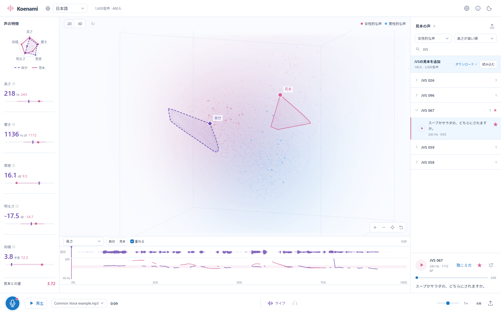
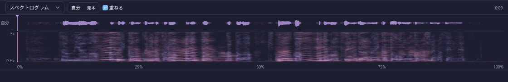

# Koenami

A voice training tool for anyone working toward a feminine or masculine voice: people aiming to become 両声類 (able to speak in both a feminine and a masculine voice), transgender people, and anyone who simply wants to try a voice they do not have yet. Japanese comes first, followed by Mandarin, English, and Korean. Free and open source.

Pick a voice you want to get closer to, from the bundled references or your own audio, then record while imitating it. Your voice is projected into the same acoustic space, so you can see how close you are and in which direction the gap lies. Real-time measurement plots the microphone as you speak, so you can adjust while watching the distance shrink.

Planned next: voice-training tutorials, analysis from the angles of phonetics, vocal pedagogy, acoustics and anatomy, and evaluation that tracks how listeners actually hear a voice more closely.

[Public demo](https://koe.transnavi.jp/) · [Source](https://github.com/transnavi/koenami) · [MIT license](LICENSE)

<picture>
  <source media="(prefers-color-scheme: dark)" srcset="docs/images/studio-dark.png">
  
</picture>

The recording track in these screenshots uses a public Common Voice clip.

- Record with **R**, play with **Space**, cancel with **Esc**.
- **Live** continuously plots microphone input. Its shape shows the most recent five seconds; settings let you choose 1–30 seconds. The headphones button enables microphone monitoring; headphones avoid acoustic feedback.
- Recordings are saved and playable as soon as capture stops. Measurements finish in the background, so another take can start immediately. Saved recordings remain available after refresh. Their averages appear on the map; the recording title opens the history menu. Each row has download and delete buttons.
- Compare pitch, resonance, harmonicity, spectral balance, and pitch variation. Orbit, pan, and scroll to zoom the 3D map. The dock combines a waveform playback timeline with pitch, spectrum, and spectrogram comparisons. Click the waveform to seek or drag to select a section.
- Share a verdict: the toolbar's share button scores the current recording on the female–male contrast axis of the selected language (signed: 0 halfway between the group medians, −25 the male median, +25 the female median, so feminine, masculine and androgynous goals read off the same scale), draws a card with the five measurements and the reference cloud, and offers X / Bluesky / Misskey posts, a link, and a PNG. The link carries only the five numbers; `/r` recomputes the result and the Worker renders the card as the link's preview image (`/og.png`, resvg-wasm with a subset Noto Sans JP built by `build_share_font.py`).
- Browse references by speaker, search speaker IDs with or without spaces, favorite individual clips, and adjust playback speed without changing pitch.
- Import an official **JVS ZIP or extracted folder** through the **JVS banner** in the sample library. Imports are verified against original-file checksums, saved in IndexedDB, and restored on refresh. A single speaker folder also works.



The current map uses speaker-balanced PCA of five acoustic measurements. The comparison readout reports the full five-dimensional acoustic distance to the selected reference (zero means equal measured features). Its report shows how much of the difference is omitted by the 2D or 3D projection. It is not calibrated to listener judgments of gender, naturalness, or vocal quality. The underlying measurements can vary with phonetic content and recording conditions. See the app’s method page for definitions and limitations.

## Local development

Requires Node.js 22.12 or newer, Python 3.12, and [uv](https://docs.astral.sh/uv/).

```sh
npm ci
uv venv --python 3.12 .venv
uv pip install --python .venv/bin/python -r requirements.txt
.venv/bin/python fetch_demo.py
npm run dev
```

Open `http://localhost:8766/ja/`. Vite provides HMR and proxies the Python analyzer on port 35511. Where `devrun` is available, launch with `devrun npm run dev` to cap resources and stop both services together.

`fetch_demo.py` downloads the reference audio from the public demo. The datasets are not included in this repository. To rebuild the larger local JVS collection, download the official archive into `research/jvs_ver1.zip`, then run `build_native.py` and `build_import_index.py`. Development loads all 5,000 prepared JVS recordings by default. The public-demo fetch supplies an import index without requiring a local copy of the full archive. To rebuild the Japanese Common Voice collection from its pinned source, run `.venv/bin/python build_common_voice_ja.py`; selection rules are in `curation/common-voice-ja.json`. Run `.venv/bin/python screen_reference_speech.py` (or `--cpu` without CUDA), then rebuild the collection. The screen runs Silero VAD and a Whisper transcription over every eligible clip and drops a clip when little speech is detected and the transcript is empty, a stock phrase Whisper emits on silence, or unintelligible against the prompt at a very low level. Model outputs are cached by audio checksum; verdicts are recomputed on each run. Display numbers are preserved in `curation/reference-labels.json`.

Listening reviews run in a separate local page, `http://localhost:8766/review.html`, which plays one clip per unreviewed speaker — Common Voice speakers, the 100 JVS professionals on one shared parallel sentence, and VOICEVOX voices interleaved 5 : 2 : 1 — and appends each judgement (0–6 ratings, perceived age as a decade, perceived age as a decade, per-clip quality flags — empty, murmur, noise, distortion — and native-like or non-native pronunciation as the 母語話者らしさ rating) to `curation/reviews.jsonl`. `curation.py` derives every exclusion and classifier label from that log; `build_common_voice_ja.py` and `build_pronunciation_model.py` read it. A second local page, `/pairs.html`, presents two clips that sit close in the five-feature space (one pair in four is a distant control) and records which sounds more feminine, more natural, and which she would rather use as a reference, to `curation/pairs.jsonl`. Neither page is published. Building the pronunciation classifier needs the WavLM ONNX model from `prepare_voice_models.py` (WavLM weights are MIT; the audEERING age model it also prepares is CC BY-NC-SA 4.0 and is not used by the app).

`measure/` is the measurement engine in Rust, on the Phonia crates (`phx-pitch`, `phx-formant`, `phx-voice`): the same pitch, formant, harmonicity and spectral-balance analysis as `acoustics.py`, built once for the reference libraries (`cargo build --release` in `measure/`, then `measure/target/release/koenami-measure FILE...` prints one JSON line per file, or `--pcm 16000` reads raw float samples from stdin) and, in a later step, for the browser. It needs Rust 1.88 or newer; `measure/.cargo/config.toml` makes Cargo fetch the Phonia crates through the git command so an SSH alias for GitHub works. `measure/parity.py` compares it with `acoustics.py` on identical 16 kHz samples: pitch, harmonicity, balance and the quiet-interval statistics agree to rounding; formants differ by 0.4% in ΔF at the median and up to 4% on individual clips (F1 alone up to 20% on a clip), which is the Phonia Burg tracker's own residual against Praat. Measuring a file instead of samples adds the resampler seam (SciPy's polyphase filter in `acoustics.mono16` against rubato's windowed sinc in the crate), visible as a 10⁻⁴ shift in F0 against the committed 3.0.0 caches.

`build_pronunciation_model.py` evaluates the small listening-reviewed Japanese classifier with one speaker held out at a time. Set `KOENAMI_CUDA=1` in an environment with CUDA ONNX Runtime for model inference. Tentative pronunciation judgements are omitted from training. The prototype has insufficient validation for automatic filtering.

Optional word timing uses Whisper large-v3-turbo with CUDA and Sudachi. Install `requirements-asr.txt` and run `download_asr.py`. Optional VOICEVOX preparation uses `build_voicevox.py` with the separately installed VOICEVOX core, models, and dictionaries. These services are not required for the public demo.

## Public deployment

The frontend and approved sample files run on Cloudflare Workers Static Assets. A Cloudflare Container runs the same Python acoustic analyzer. The configuration permits one `basic` container, which sleeps after one minute idle. Public recordings are limited to one minute; failed analysis preserves the recording and offers retry from its title menu. GPU word timing is available only in the local setup.

```sh
npm run build:public
npm run check:worker
npx wrangler deploy
```

Configure your own Cloudflare account and hostname in `wrangler.jsonc` before deploying a fork. Docker must be running for the container build. Production deployments use `main`.

`prepare_public.py` creates an explicit deployment set in `.deploy/`. It copies only approved reference files and verifies their checksums. Private recordings, the full JVS archive, and research scratch files are excluded. The container includes only the prepared inference models and their upstream license notices; weights are never served as static assets. The Docker context uses an allowlist as an additional boundary.

## Data and licenses

**The MIT license applies to the application code. Audio, transcripts, metadata, model weights, and dependencies retain their original licenses.**

The public demo includes 10 JVS clips under the author’s small-website-excerpt allowance, Japanese Common Voice clips with speaker and clip exclusions recorded in `curation/common-voice-ja.json`, 54 credited VOICEVOX clips, and Common Voice collections in Mandarin, English, and Korean. The Japanese JVS corpus documents native professional speakers. Japanese Common Voice includes adult-labelled recordings with at least two positive votes and no negative votes. Known pronunciation mismatches and explicitly declared non-native accents are excluded. Most speakers have not undergone listening review; Japanese dialect metadata alone does not establish native pronunciation. Native-speaker screening is also incomplete for the other languages.

- [JVS terms](https://sites.google.com/site/shinnosuketakamichi/research-topics/jvs_corpus): personal and noncommercial research use; full audio redistribution is restricted. JVS tags are CC BY-SA 4.0. The import index includes adapted metadata and computed acoustic measurements; it contains no audio.
- [Common Voice](https://commonvoice.mozilla.org/): CC0 audio collections. Clip-level manifests preserve the source and checksums.
- [VOICEVOX terms](https://voicevox.hiroshiba.jp/term/) and [voice library terms](https://github.com/VOICEVOX/voicevox_vvm/blob/main/README.md): credit and character-specific conditions apply. Audio reuse must follow those terms.

VOICEVOX credits: 四国めたん、春日部つむぎ、雨晴はう、冥鳴ひまり、九州そら、中国うさぎ、玄野武宏、白上虎太郎、栗田まろん. Each sample displays its `VOICEVOX:<character>` credit.

Microphone audio and selected imported samples are sent to the analysis service for measurement. The analyzer does not save uploaded audio. Completed recordings and user-imported libraries are stored in the browser; clearing site data removes them.

## Verification

```sh
npm run build:public
npm run check:worker
node score_test.mjs
.venv/bin/python demo_browser_test.py
.venv/bin/python review_browser_test.py
```

The browser suite checks live monitoring, persistence, plotted recording history, recording limits, analysis failure recovery, JVS import and playback, selected-range analysis, and desktop/mobile layouts. It requires the official JVS archive for its small import fixture and a locally installed Playwright Chromium. `tests.py` contains additional acoustic regression checks against local controlled audio fixtures; those fixtures are not published.

## Acknowledgments

The comparison workflow draws on [Acoustic Gender Space](https://acousticgender.space/), [Phonia](https://phonia.app/), and [InFormant](https://in-formant.app/). Colors draw on [とらんすナビ](https://transnavi.jp/). The app is independently developed.

For Chinese-language practice material, see [あおぎ葵’s MTF声音女性化练习手册](https://www.bilibili.com/opus/546442165017071774), a community guide covering source–filter concepts and Praat examples. Measurement definitions are documented on the app’s method page.
